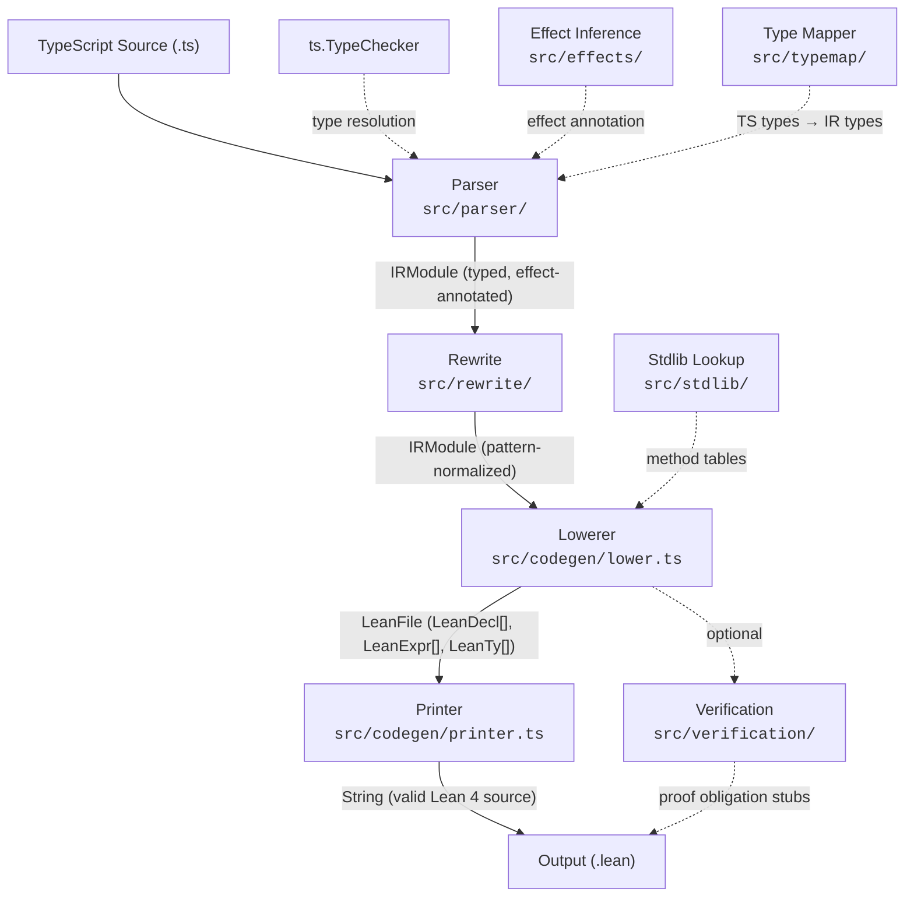

# TSLean Architecture

## Pipeline Overview

TSLean is a five-stage compiler that transforms TypeScript source into verified Lean 4 code. Every stage operates on an explicitly typed, effect-annotated intermediate representation (IR), so downstream passes never need to re-analyze the original TypeScript AST.



```
TypeScript Source (.ts)
        │
        ▼
┌──────────────┐    ts.TypeChecker ──► Type resolution
│   Parser     │◄── typemap/       ──► TS types → IR types
│  (parser/)   │◄── effects/       ──► Effect inference
└──────┬───────┘
       │ IRModule (typed, effect-annotated)
       ▼
┌──────────────┐
│   Rewrite    │    Discriminated union → inductive pattern matching
│  (rewrite/)  │    Struct literal → CtorApp normalization
└──────┬───────┘
       │ IRModule (pattern-normalized)
       ▼
┌──────────────┐
│   Lowerer    │    IR → LeanAST, import resolution, mutual detection
│  (codegen/)  │◄── stdlib/ (method dispatch tables)
└──────┬───────┘
       │ LeanFile (LeanDecl[], LeanExpr[], LeanTy[])
       ▼
┌──────────────┐
│   Printer    │    LeanAST → valid Lean 4 text, keyword sanitization
│  (codegen/)  │
└──────┬───────┘
       │ String (valid Lean 4 source)
       ▼
  Output (.lean)
```

## Source Modules in Detail

### `src/parser/index.ts` (1564 lines)

The front-end parser. Creates a `ts.Program` with a `TypeChecker`, walks the TypeScript AST, and produces a fully-typed, effect-annotated `IRModule`.

**Entry point:** `parseFile(opts: ParseOptions): IRModule`

**Key responsibilities:**
- **Import collection** — relative and external module specifiers are resolved to Lean module paths.
- **Statement dispatch** — routes each top-level statement to specialized handlers: `parseFnDecl`, `parseClassDecl`, `parseInterface`, `parseTypeAlias`, `parseEnum`, `parseVarStmt`, `parseNamespace`, `parseExportDecl`.
- **Class handling** — extracts state fields, detects Durable Object patterns (via `DurableObject` heritage), synthesizes constructors, parses methods including getters and setters.
- **CPS early-return transform** — `if (cond) return x; rest` becomes `if cond then x else rest` to produce functional-style Lean without early exits.
- **Loop transforms** — `for`, `for-of`, `for-in`, `while`, `do-while` are converted to tail-recursive `let rec` helpers.
- **Switch → Match** — switch statements become pattern match expressions, with fall-through handling and discriminated union detection.
- **Expression parsing** — handles 30+ TypeScript node types: literals, identifiers, property access, calls, `new`, lambdas, binary/prefix/postfix ops, ternary, object/array literals, `await`, `as`/`satisfies`, template strings, optional chaining, `typeof`, `delete`, regex, destructuring.
- **Destructuring** — `flattenObjectBinding()` and `flattenArrayBinding()` with nested support and default values.
- **JSDoc extraction** — strips `@param`/`@returns` tags, preserves summary descriptions as Lean doc comments.

### `src/ir/types.ts` (411 lines)

The central data model. Defines the entire intermediate representation: the type universe, expression language, declarations, effects, patterns, and module structure.

- **`Effect`** — discriminated union with 6 variants: `Pure`, `State`, `IO`, `Async`, `Except`, `Combined`. Effects form a join-semilattice with `Pure` as bottom.
- **`IRType`** — discriminated union with 23 variants covering primitives (`Nat`, `Int`, `Float`, `String`, `Bool`, `Unit`, `Never`), containers (`Option`, `Array`, `Tuple`, `Map`, `Set`, `Promise`, `Result`), named types (`Structure`, `Inductive`, `TypeRef`, `TypeVar`), and advanced types (`Function`, `Dependent`, `Subtype`, `Universe`).
- **`IRExpr`** — discriminated union with 37+ variants covering literals, variables, function application, let-binding, monadic bind, if-then-else, match, do-blocks, state get/set, throw/try-catch, await, assignment, binary/unary ops, casts, type tests, and structural operations.
- **`IRDecl`** — discriminated union with 14 variants: `TypeAlias`, `StructDef`, `InductiveDef`, `FuncDef`, `InstanceDef`, `TheoremDef`, `ClassDecl`, `Namespace`, `RawLean`, `VarDecl`, `SectionDecl`, `AttributeDecl`, `DeriveDecl`.
- **`IRModule`** — `{ name, imports, exports?, decls, comments, sourceFile? }`, the top-level unit passed between pipeline stages.

Every `IRExpr` node implements the `IRNode` mixin, carrying a resolved `type: IRType` and `effect: Effect`. This is the central invariant — the IR is always fully typed and effected.

### `src/typemap/index.ts` (410 lines)

Maps TypeScript compiler types (via `ts.TypeChecker`) to IR types. Recursion depth is capped at 20 to handle circular types.

**Entry point:** `mapType(t: ts.Type, checker, depth?): IRType`

**Key features:**
- Primitive mapping: `number` → `Float`, `string` → `String`, `boolean` → `Bool`, `void`/`undefined` → `Unit`, `never` → `Empty`, `any`/`unknown` → `TSAny`, `bigint` → `Int`.
- Union simplification: `T | undefined` → `Option T`, string literal unions → `TyRef(alias)`, `true | false` → `Bool`.
- Intersection handling: branded newtypes (`string & { __brand: X }`) → `TyRef(alias)`.
- Container recognition: `Array<T>` → `TyArray`, `Map<K,V>` → `TyMap`, `Set<T>` → `TySet`, `Promise<T>` → `TyPromise`.
- Discriminated union detection: checks fields `kind`, `type`, `tag`, `ok`, `hasValue`, `_type`, `__type` in order.
- Utility type pass-through: `Readonly<T>`, `NonNullable<T>`, `Required<T>` are transparent (Lean is immutable).

**Additional exports:**
- `irTypeToLean(t: IRType, parens?): string` — renders IR types as Lean 4 syntax strings.
- `extractStructFields(node, checker): StructField[]` — extracts interface/class property signatures.
- `detectDiscriminatedUnion(t, checker): DiscriminantInfo | null` — detects tagged unions.
- `extractTypeParams(node, checker?): TypeParam[]` — extracts generic parameters with constraints and defaults.

### `src/effects/index.ts` (209 lines)

Infers which algebraic effects a function body uses by scanning the TypeScript AST.

**Entry point:** `inferNodeEffect(node, checker): Effect`

**Scanning rules (each scanner never recurses into nested function scopes):**
- `bodyContainsAwait()` → `Async` effect
- `bodyContainsThrow()` → `Except` effect (with `String` error type)
- `bodyContainsMutation()` → `State` effect (assignment operators, `++`/`--`)
- `bodyContainsIO()` → `IO` effect (triggers: `console.*`, `Date.*`, `Math.random`, `crypto.*`, `fetch`)

**Monad string generation:**
- `monadString(effect)` builds the Lean 4 monad transformer stack right-to-left: `StateT S (ExceptT E IO)`.
- `doMonadType(stateTypeName)` generates `DOMonad S` for Durable Objects.
- `joinEffects(a, b)` computes the least upper bound.
- `effectSubsumes(a, b)` tests whether `a` can handle `b`.

### `src/rewrite/index.ts` (333 lines)

Post-parse IR transformation pass. The hallmark transformation: converts string-discriminant `switch`/`match` into proper inductive pattern matching.

**Entry point:** `rewriteModule(mod: IRModule): IRModule`

**Transformations:**
1. **Union registry** — `collectUnionInfo()` builds a map from `InductiveDef` declarations, tracking which discriminant value maps to which constructor.
2. **Match rewriting** — `rewriteMatch()` detects `obj.kind`/`obj.tag` scrutinees, rewrites `PString("circle")` patterns to `PCtor("Shape.Circle", [radius])`, and lifts constructor fields into scope.
3. **Struct literal rewriting** — `rewriteStructLit()` converts `{ type: "left", value: v }` to `CtorApp("Either.Left", [v])` when the discriminant matches a known union.
4. **Field access substitution** — `substituteFieldAccesses()` recursively replaces `s.radius` with the bare binding `radius` inside match arm bodies.

### `src/codegen/lean-ast.ts` (184 lines)

Typed AST for Lean 4 surface syntax — the intermediate between IR and text output.

- **`LeanTy`** — 5 variants: `TyName`, `TyApp`, `TyArrow`, `TyTuple`, `TyParen`.
- **`LeanPat`** — 10 variants: `PVar`, `PWild`, `PCtor`, `PLit`, `PNone`, `PSome`, `PTuple`, `PStruct`, `POr`, `PAs`.
- **`LeanExpr`** — 30 variants covering literals, variables, application, let/bind, if/match/do, pure/return/throw, try-catch, modify, operators, field access, struct literal/update, string interpolation, sequences, type annotations, comments, panic.
- **`LeanDecl`** — 16 variants: `Def`, `Structure`, `Inductive`, `Abbrev`, `Instance`, `Theorem`, `Class`, `Mutual`, `Namespace`, `Section`, `Import`, `Open`, `Attribute`, `Deriving`, `StandaloneInstance`, `Raw`, `Comment`, `Blank`.

### `src/codegen/lower.ts` (1664 lines)

The lowering pass: IR → LeanAST. The largest source file. Every semantic decision about how TypeScript maps to Lean happens here.

**Entry point:** `lowerModule(mod: IRModule): LeanFile`

**Key operations:**
- **Pre-passes:** `collectStructInfo()` enriches struct fields from method body analysis; `collectDefinedNames()` builds the scope.
- **Import resolution:** `resolveImports()` maps IR imports to Lean `import` declarations, scanning for type and expression references.
- **Missing state structs:** `emitMissingStateStructs()` auto-generates empty state structures for types referenced but not defined in the current module.
- **Mutual detection:** `lowerDeclsWithMutual()` finds cross-referencing type declarations and wraps them in `mutual...end` blocks.
- **Declaration lowering:** Specialized handlers for structs (→ `structure`), inductives (→ `inductive`), type aliases (→ `abbrev`), functions (→ `def`), variables (→ `def`), instances, theorems, classes, namespaces.
- **Expression lowering:** All 37+ IR expression variants map to `LeanExpr`, including: field access (JS → Lean name mapping), method call translation via `stdlib/`, struct literal/update, binary operator dispatch, assignment (→ `modify`), casts, `typeof`/`instanceof` (→ `sorry`).
- **Sorry degradation:** When a construct has no Lean equivalent, the lowerer emits `sorry` with a tracked `SorryEntry` categorized by reason.

### `src/codegen/printer.ts` (646 lines)

Pretty-prints LeanAST to valid Lean 4 source text. Purely structural — no heuristics.

**Entry point:** `printFile(file: LeanFile): string`

**Key features:**
- Handles all 16 `LeanDecl` variants and all 30 `LeanExpr` variants.
- `sanitize()` wraps Lean keywords (45 reserved words) in guillemets (`«name»`) and replaces special characters.
- Manages indentation for multiline expressions (do-blocks, let-chains, match arms).
- Separate `printExpr()` (indented multiline) and `printExprInline()` (inline, no leading indent) for contextual formatting.
- `printTy()` and `printTyAtom()` handle type printing with correct parenthesization.

### `src/codegen/v2.ts` (112 lines) and `src/codegen/index.ts` (47 lines)

The public codegen API. `generateLeanV2()` calls `lowerModule()` then `printFile()`. Optional self-host transforms remap namespaces and imports for the self-hosting pipeline. `generateLeanTracked()` appends a sorry summary comment to the output.

### `src/stdlib/index.ts` (240 lines)

JavaScript standard library → Lean 4 mapping tables. Contains method translation tables organized by object kind.

- **String methods** — 29 entries (length, toUpperCase, toLowerCase, trim, includes, startsWith, endsWith, slice, split, replace, replaceAll, indexOf, lastIndexOf, charAt, padStart, padEnd, repeat, at, match, search, concat, normalize, toString, valueOf, etc.)
- **Array methods** — 35 entries (size, push, pop, shift, unshift, map, filter, reduce, reduceRight, forEach, find, findIndex, findLast, some, every, includes, indexOf, slice, splice, concat, join, reverse, flat, flatMap, sort, fill, copyWithin, at, with, keys, values, entries, toString)
- **Map methods** — 10 entries (get, set, has, delete, size, keys, values, entries, forEach, clear)
- **Set methods** — 9 entries (add, has, delete, size, forEach, values, keys, entries, clear)
- **Global functions** — 80+ entries covering `console.*`, `Math.*` (25 functions + 6 constants), `Number.*`, `parseInt`/`parseFloat`, `JSON.*`, `Object.*`, `Array.*`, `Promise.*`, `setTimeout`/`setInterval`, `fetch`, `crypto.*`, URI functions, `structuredClone`.
- **Binary operator translation** — maps IR binary ops to Lean operators, with string-aware `++` for `Add`.

### `src/do-model/ambient.ts` (125 lines)

Cloudflare Workers / Durable Objects ambient type declarations. Injects a virtual `.d.ts` file when DO patterns are detected, providing type definitions for `DurableObjectState`, `DurableObjectStorage`, `Request`, `Response`, `WebSocket`, etc., so the TypeScript checker resolves types without needing `@cloudflare/workers-types`.

### `src/verification/index.ts` (112 lines)

Generates proof obligation stubs for safety properties. Walks the IR tree and emits Lean theorem stubs:

- `IndexAccess` → `ArrayBounds` obligation
- `BinOp` with `Div`/`Mod` → `DivisionSafe` obligation
- `FieldAccess` `.value`/`.get` on Option → `OptionIsSome` obligation

The `--verify` flag enables this pass. Emitted theorems use standard Lean 4 tactics (`simp`, `cases`).

### `src/project/` (4 files, 576 lines total)

Multi-file transpilation orchestrator:

- **`index.ts`** (147 lines) — `transpileProject()` reads config, builds the dependency graph, transpiles in topological order, and generates lakefile artifacts.
- **`dependency-graph.ts`** (204 lines) — Implements Tarjan's SCC algorithm for cycle detection and Kahn's algorithm for topological sort. Produces `DependencyGraph` with `{ nodes, order, cycles }`.
- **`module-resolver.ts`** (158 lines) — Single source of truth for file path → Lean module name resolution. Handles relative imports, path aliases, and known externals (e.g., `zod` → `TSLean.Stdlib.Validation`).
- **`reader.ts`** (180 lines) — Reads `tsconfig.json`, discovers source files, creates a shared `ts.Program` for cross-file type checking.
- **`lakefile-gen.ts`** (67 lines) — Generates `lakefile.toml`, `lean-toolchain`, and root barrel `.lean` module.

### `src/stubs/dts-reader.ts` (330 lines)

Reads `.d.ts` files from npm packages and generates Lean stub modules with opaque types and axiomatized functions. Includes caching in `.tslean-cache/stubs/`.

### `src/errors.ts` (172 lines)

Structured error reporting with 15 error codes in ranges: TSL001–005 (parser), TSL100–103 (types), TSL200–205 (lowering), TSL300–302 (project), TSL400–401 (Lean build). Each diagnostic carries a code, severity, location, message, auto-populated explanation, and suggestion. `DiagnosticCollector` aggregates errors across the pipeline.

### `src/sorry-tracker.ts` (75 lines)

Tracks `sorry` degradation points during transpilation. Eight categories: `unresolved-expr`, `unresolved-type`, `runtime-api`, `type-test`, `inductive-field`, `mutation`, `control-flow`, `generator`, `other`. Each file gets a fresh tracker via `resetTracker()`.

### `src/timing.ts` (59 lines)

Pipeline timing instrumentation. `PipelineTimer` tracks elapsed time for each phase (parse, rewrite, codegen, verify, write). Enabled with the `--timing` CLI flag; prints a bar chart report.

### `src/preprocessor/tsc-to-json.ts` (520 lines)

Standalone CLI tool that serializes a TypeScript AST with rich type information to JSON (v2 format). Used for debugging and as an alternative front-end.

### `src/cli.ts` (468 lines)

The CLI entry point. Parses arguments and dispatches to commands:

| Command | Flag | Description |
|---------|------|-------------|
| Compile (single) | `tslean input.ts -o output.lean` | Single-file pipeline |
| Compile (project) | `tslean --project [dir]` | Multi-file mode via tsconfig |
| Watch | `-w / --watch` | Recompile on file change (250ms debounce) |
| Watch + lake | `--watch --lake` | Recompile + auto `lake build` |
| Verify | `--verify` | Generate proof obligation stubs |
| Self-host | `--self-host` | Run the self-hosting pipeline |
| Fixpoint | (via script) | Verify self-hosted output matches |
| Init | `tslean init [dir]` | Scaffold project with `tslean.json` |
| Timing | `--timing` | Print per-phase timing report |
| Strict | `--strict` | Enable strict type checking |

## Lean Runtime Library Organization

The Lean library at `lean/TSLean/` is pure Lean 4.29.0 with no external dependencies (no Mathlib). It provides the runtime support that transpiled code imports.

```
lean/TSLean/
├── Runtime/              Core type definitions and monads
│   ├── Basic.lean          TSError, TSAny, base types
│   ├── Monad.lean          DOMonad = StateT σ (ExceptT TSError IO)
│   ├── BrandedTypes.lean   Branded newtype wrappers
│   ├── Coercions.lean      Cross-type coercions (Nat↔Float, etc.)
│   ├── Inhabited.lean      Default/Inhabited instances
│   ├── JSTypes.lean        JS-compatible type definitions
│   ├── Validation.lean     Input validation combinators
│   └── WebAPI.lean         fetch, Request, Response, Headers stubs
├── Stdlib/               JS standard library equivalents
│   ├── String.lean         includes, slice, replaceFirst, replaceAll, padStart, padEnd, repeat_, etc.
│   ├── Array.lean          shift, unshift, splice, flatten, flatMap, sort, fill, findLast, etc.
│   ├── HashMap.lean        AssocMap (association list map): find?, insert, erase, keys, values, etc.
│   ├── HashSet.lean        AssocSet (association list set): insert, contains, erase, toList, etc.
│   ├── Numeric.lean        FloatExt (trunc, log2, log10, isFinite, sign), parseInt
│   ├── Async.lean          promiseAll, promiseRace, promiseReject, setTimeout, setInterval
│   ├── JSON.lean           serialize/deserialize stubs
│   └── OptionResult.lean   Option/Except convenience functions
├── Effects/              Effect system
│   ├── Core.lean           EffectKind enumeration
│   └── Transformer.lean    Monad transformer stack combinators
├── DurableObjects/       Cloudflare DO model and verification
│   ├── Model.lean          AssocMap-based Storage model
│   ├── State.lean          DurableObjectState
│   ├── Storage.lean        DurableObjectStorage operations
│   ├── Http.lean           Request/Response for DO fetch()
│   ├── WebSocket.lean      WebSocket pair model
│   ├── RPC.lean            RPC stub methods
│   ├── Auth.lean           Authentication DO patterns
│   ├── Analytics.lean      Analytics DO patterns
│   ├── ChatRoom.lean       Chat room DO example
│   ├── Hibernation.lean    WebSocket hibernation API
│   ├── MultiDO.lean        Multi-DO composition
│   ├── Queue.lean          Queue processor patterns
│   ├── RateLimiter.lean    Rate limiter DO model
│   ├── SessionStore.lean   Session store DO model
│   ├── Transaction.lean    Storage transactions
│   └── Alarm.lean          Alarm API
├── Verification/         Proof infrastructure
│   ├── ProofObligation.lean  Obligation kind enumeration
│   ├── Invariants.lean       State invariant framework
│   └── Tactics.lean          Custom tactic helpers
├── Stubs/                Node.js API stubs (axiomatized)
│   ├── Console.lean        IO.println / IO.eprintln
│   ├── NodeFs.lean         readFileSync, writeFileSync, existsSync, etc.
│   ├── NodePath.lean       join, resolve, dirname, basename, extname, etc.
│   ├── NodeHttp.lean       createServer, request types
│   └── Process.lean        env, argv, exit, cwd
├── External/             Third-party package stubs
│   ├── Fs.lean             Extended filesystem stubs
│   ├── Path.lean           Extended path stubs
│   └── Typescript.lean     TS compiler API stubs (for self-hosting)
├── Proofs/               Transpiler correctness proofs
│   ├── TypeMapping.lean      Type mapping preservation
│   ├── TypePreservation.lean Type safety through pipeline
│   ├── ExprPreservation.lean Expression lowering correctness
│   ├── EffectPreservation.lean Effect lattice correctness
│   ├── RewritePreservation.lean Rewrite pass preservation
│   ├── SemanticPreservation.lean End-to-end composition
│   ├── StdlibProperties.lean 61 algebraic laws for stdlib modules
│   └── ...
├── Generated/            Transpiler output (auto-generated)
└── Veil/                 Veil DSL for DO specification
```

## Data Flow: Single-File Pipeline

1. **Parse** (`parseFile`) — The TypeScript compiler creates a `ts.Program` and `TypeChecker`. The parser walks the AST, calling `mapType()` for every type annotation and `inferNodeEffect()` for every function body. Output: a fully-typed, effect-annotated `IRModule`.

2. **Rewrite** (`rewriteModule`) — Scans the IR for discriminated union definitions. When a `Match` expression uses a string discriminant on a known union, rewrites pattern nodes from `PString` to `PCtor` and lifts constructor fields into scope. Struct literals with discriminant fields become `CtorApp` nodes.

3. **Lower** (`lowerModule`) — Converts each IR declaration and expression to its LeanAST equivalent. Resolves imports, detects mutual type references, generates missing state structs, translates method calls via the stdlib lookup tables, and emits `sorry` for inexpressible constructs. Output: a `LeanFile` containing `LeanDecl[]`.

4. **Print** (`printFile`) — Renders the `LeanFile` to a string of valid Lean 4 source code. Handles indentation, do-notation formatting, keyword sanitization, and string interpolation.

5. **Write** — The CLI writes the Lean source to disk. If `--verify` is enabled, proof obligation stubs are appended.

## Data Flow: Multi-File Pipeline

For project mode (`--project`):

1. **Read config** (`readProjectConfig`) — Parses `tsconfig.json`, discovers `.ts` files, resolves path aliases and base URL.
2. **Shared compiler** (`createSharedCompiler`) — Creates a single `ts.Program` for all files, enabling cross-file type checking.
3. **Dependency graph** (`buildDependencyGraph`) — Builds a DAG of module dependencies. Runs Tarjan's SCC to detect cycles and Kahn's algorithm for topological sort.
4. **Transpile in order** — Each file is parsed, rewritten, and lowered in topological order. Imports resolve to Lean module paths via `fileToLeanModule()`.
5. **Generate lakefile** (`writeLakefiles`) — Emits `lakefile.toml`, `lean-toolchain` (pinned to v4.29.0), and a root barrel module that imports all sub-modules.
6. **Write outputs** (`writeProjectOutputs`) — Writes all `.lean` files to the output directory.

## Type Checker Integration

TSLean relies heavily on the TypeScript compiler API (`ts.TypeChecker`) rather than doing its own type inference. This gives several advantages:

- **Full type resolution** — generics, overloads, conditional types, and mapped types are all resolved by the TS compiler before we see them.
- **Accurate union discrimination** — the checker tells us exactly which properties exist on each union member.
- **Branded type detection** — intersection types like `string & { __brand: "UserId" }` are visible through the checker.

The parser creates a `ts.Program` (with `ts.createProgram` or `readProjectConfig`), obtains the checker, and passes it to `mapType()` for every type and `inferNodeEffect()` for every function. The `do-model/ambient.ts` module injects virtual `.d.ts` declarations for Cloudflare types when DO patterns are detected, so the checker resolves them without requiring `@cloudflare/workers-types` to be installed.
